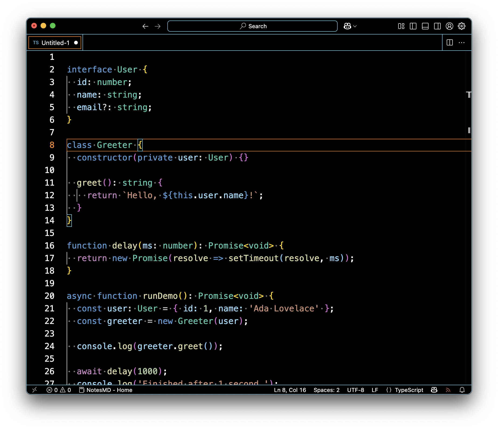
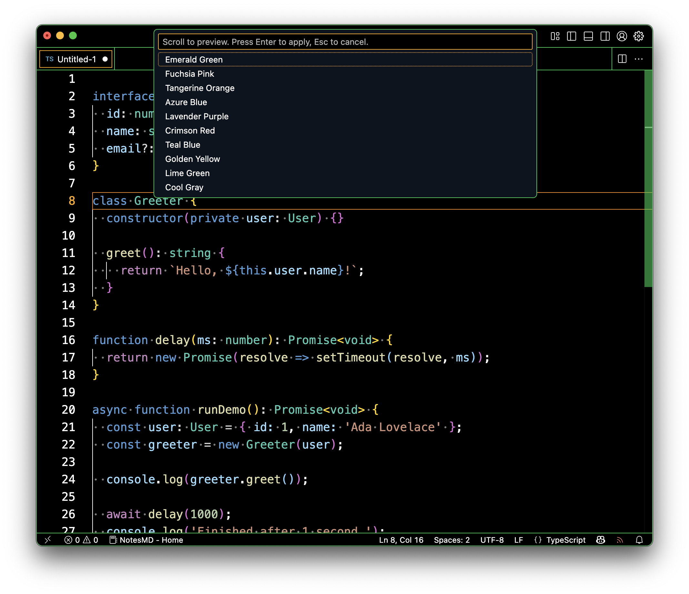
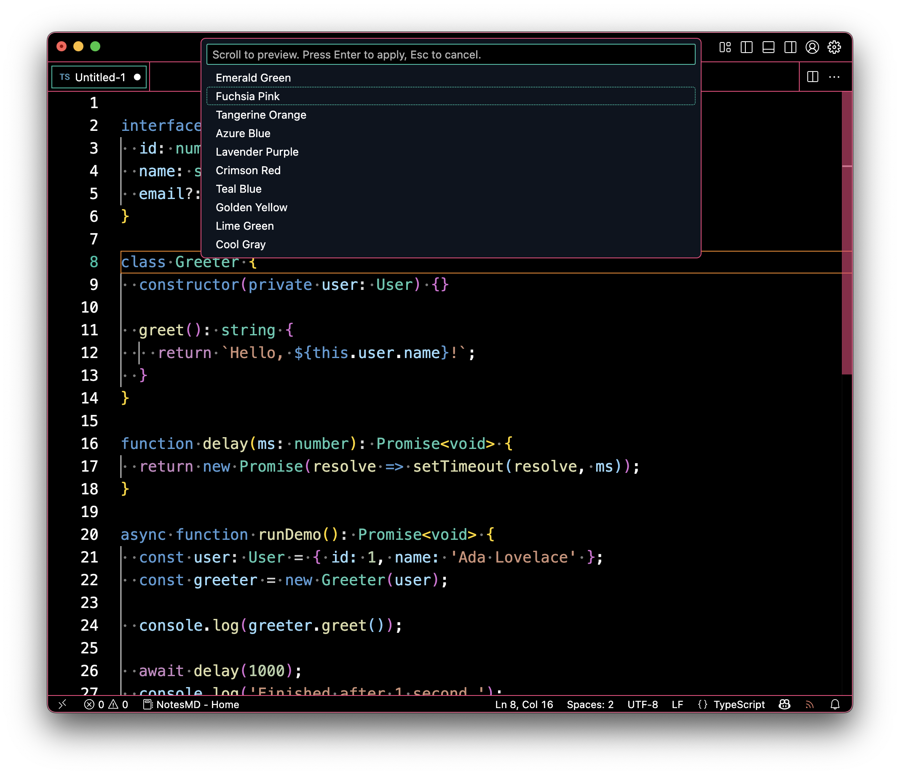
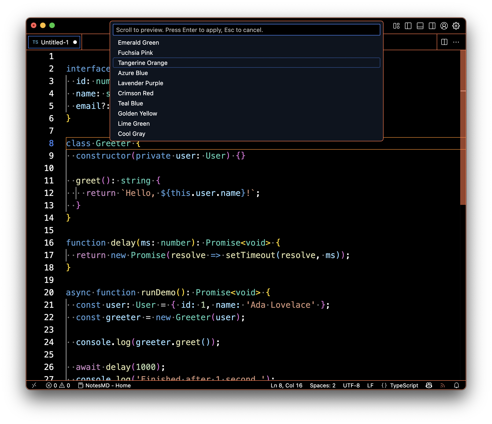
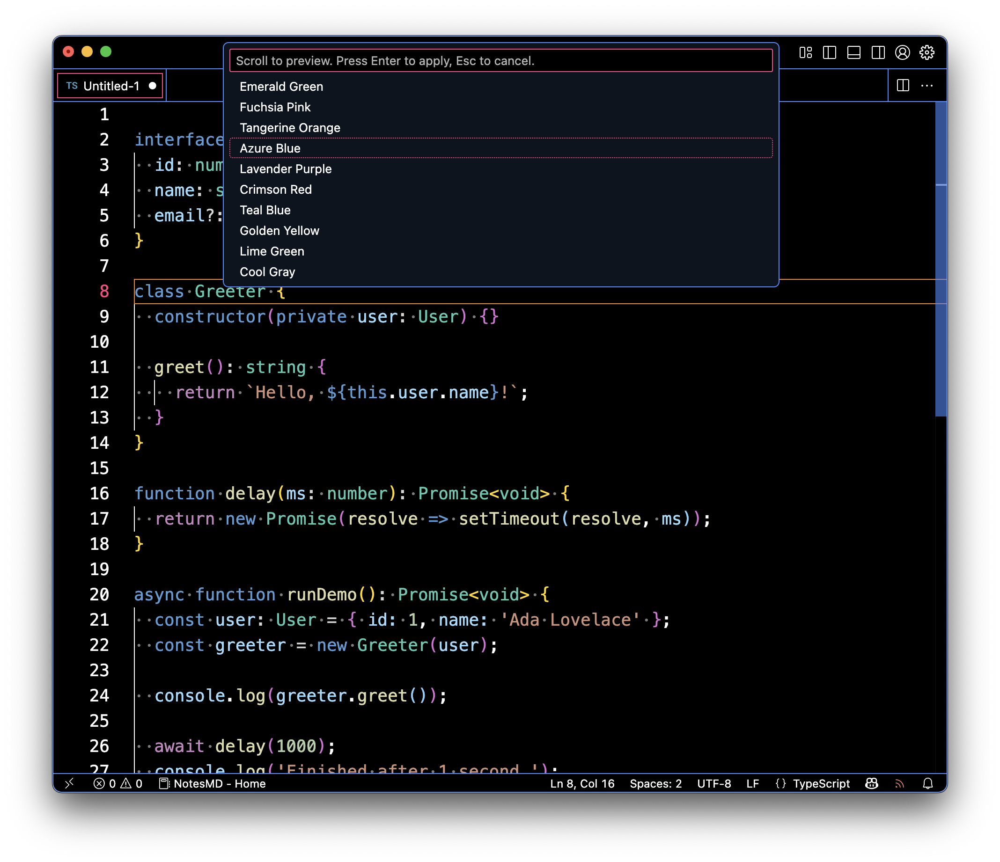
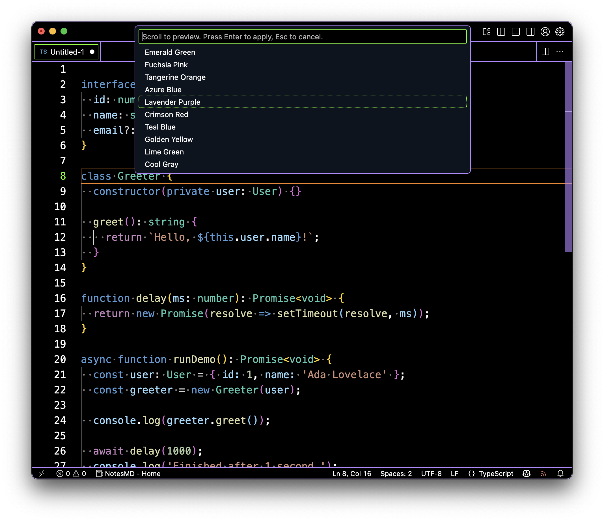
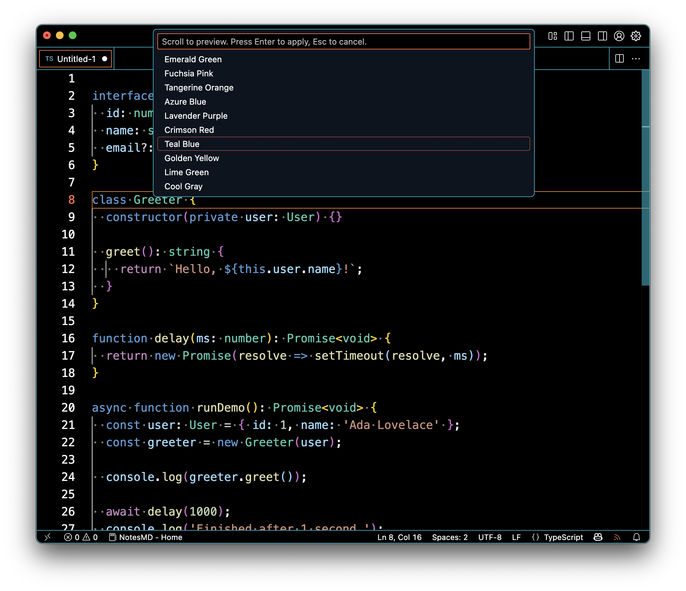
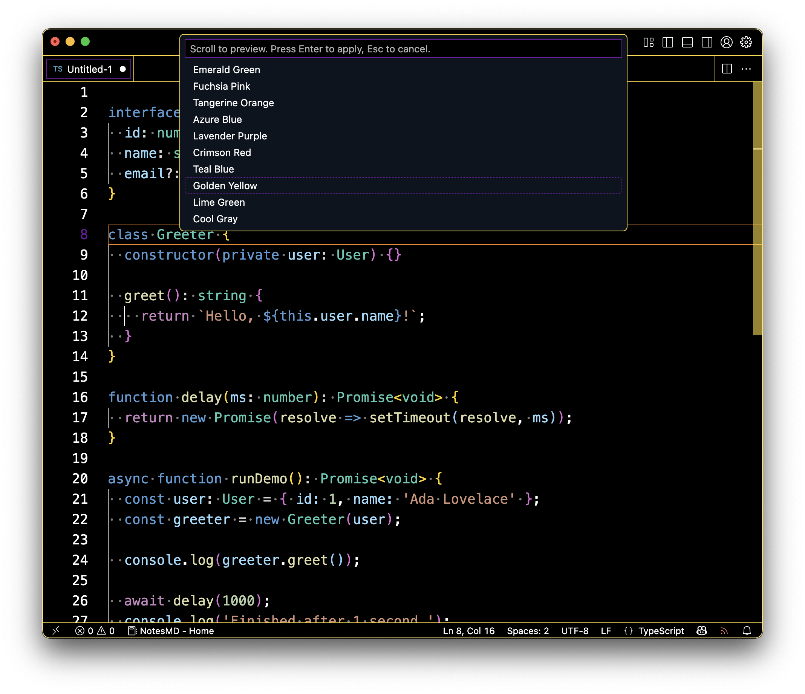
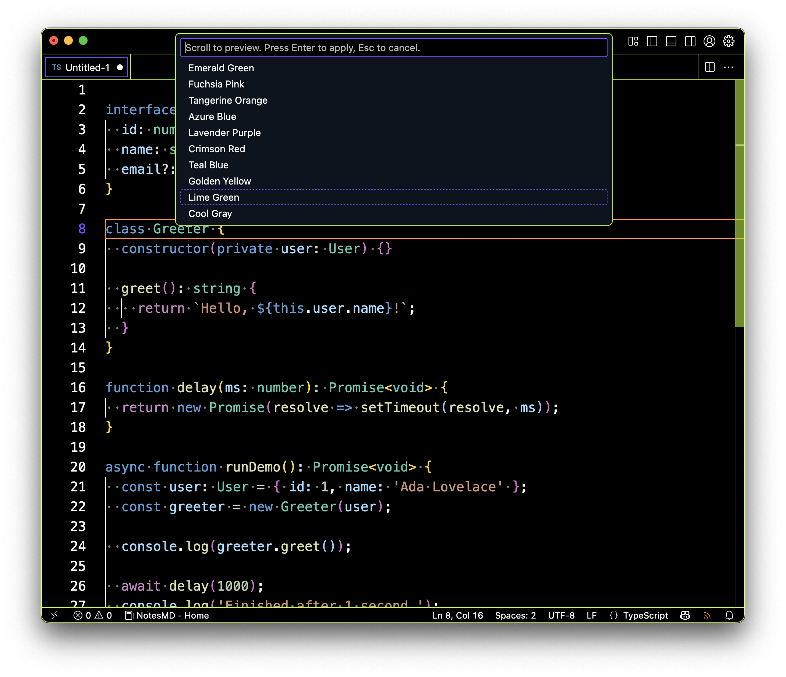
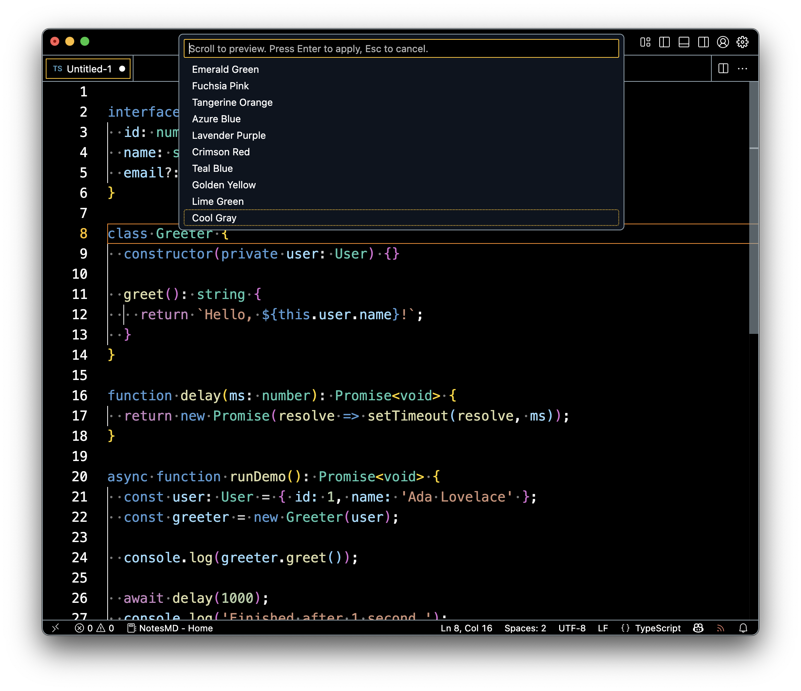

# Dark High Contrast Accent Switcher

Easily switch between 10 beautiful accent color combinations for the default **Dark High Contrast** theme in VS Code.

## Features

- Adds accent borders + focus indicators
- Works at **user or workspace level**
- Automatically applies the **Dark High Contrast** theme
- Lightweight and fast

## Usage

1. Press `Ctrl+Shift+P` / `Cmd+Shift+P`
2. Run: `Choose Accent (Dark High Contrast)`
3. Pick your accent and scope

### Resetting

To reset to the default accent, run the command `Reset Accent (Dark High Contrast)`.

## Accent Previews

Below are previews of each accent in action using the **Dark High Contrast** theme.

| Default | Emerald | Fuchsia |
|--------|---------|---------|
|  |  |  |

| Tangerine | Azure | Lavender |
|-----------|-------|----------|
|  |  |  |

| Crimson | Teal | Golden |
|---------|------|--------|
|  |  |  |

| Lime | Cool Gray |
|------|-----------|
|  |  |

